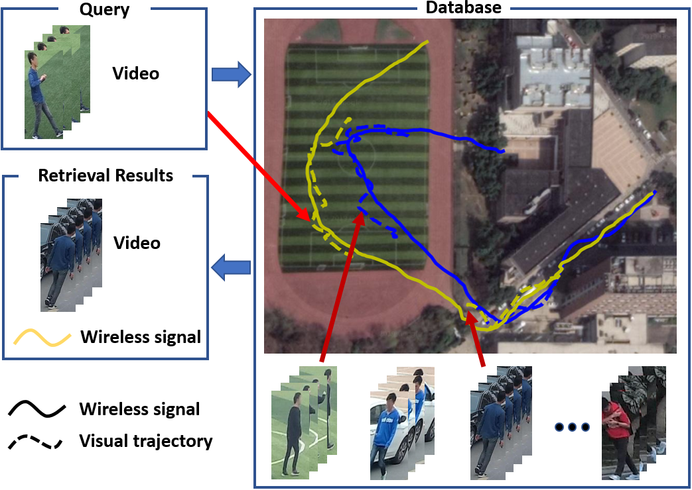

# WP-ReID
Implementation of "Vision Meets Wireless Positioning: Effective Person Re-identification with Recurrent Context Propagation"

**Vision Meets Wireless Positioning: Effective Person Re-identification with Recurrent Context Propagation**

[Yiheng Liu](https://yolomax.com/), [Wengang Zhou](http://staff.ustc.edu.cn/~zhwg/), Mao Xi, Sanjing Shen, [Houqiang Li](http://staff.ustc.edu.cn/~lihq/research.html)

MM, Oral Paper，2020.

[[PDF](https://dl.acm.org/doi/10.1145/3394171.3413984)]

## The overview of the problem studied in this work

<div  align="center"></div>

WP-ReID contains not only visual data (video sequences of pedestrians) but also wireless signals (wireless positioning trajectories of the mobile phones carried by pedestrians).

Given a query video sequence, we not only seek to retrieve other videos with the same identity but also identify the corresponding wireless signal, i.e., the wireless positioning trajectory of the corresponding mobile phone taken by the same person.

## WP-ReID Dataset


## Testing and evaluation
```shell
python main.py
```

## Contact
If you are interested in WP-ReID dataset, please contact us by email lyh156@mail.ustc.edu.cn.
<!--
## Citing RCPM
If you use RCPM or WP-ReID dataset, please use the following BibTeX entry.
```

```
-->
