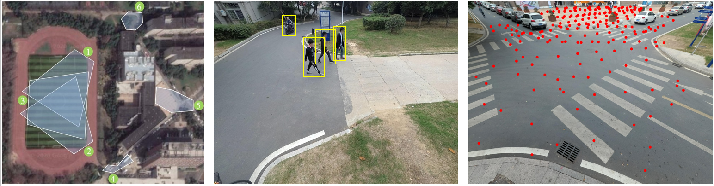

**Vision Meets Wireless Positioning: Effective Person Re-identification with Recurrent Context Propagation**

[Yiheng Liu](https://yolomax.com/), [Wengang Zhou](http://staff.ustc.edu.cn/~zhwg/), Mao Xi, Sanjing Shen, [Houqiang Li](http://staff.ustc.edu.cn/~lihq/research.html)

MM, Oral Paper，2020.

[[PDF](https://dl.acm.org/doi/10.1145/3394171.3413984)]

## WP-ReID Dataset

|  | Probe | Gallery |
| :-----:| :----: | :----: |
| #ID | 41 | 79 |
| #Tracklet | 201 | 868 |
| #Images | 29353 | 106578 |
| #Camera | 6 | 6 |
| #MaxLen | 1165 | 1165 |
| #MinLen | 3 | 3 |
| #AvgLen | 146 | 122 |

## Contact
If you are interested in WP-ReID dataset, please contact us by email lyh156@mail.ustc.edu.cn.
